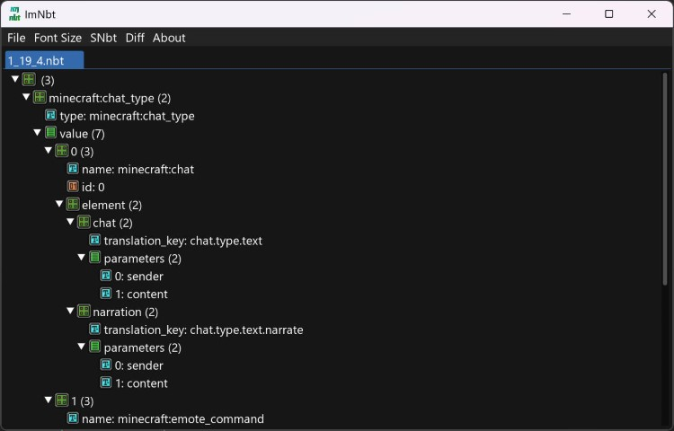

# ImNbt
A Nbt viewer and editor using ImGui.

## Download
You can download the latest release from the [releases page](https://github.com/Lenni0451/ImNbt/releases/latest) on GitHub.\
The latest dev build can be found on my [Jenkins Server](https://build.lenni0451.net/job/ImNbt/).

## Features
 - View Nbt tags in a tree view
 - Supported Formats:
   - Java/Bedrock
   - Little/Big Endian
   - GZip compressed/uncompressed
 - Edit all tag types
 - Pages for huge tags
 - SNbt parsing and serialization
 - Diff viewer for two tags
 - Drag and drop support
 - Search tag names and values

<details>
    <summary>Images of the GUI</summary>

### Main window

### Open file

### Opened tag

### Edit tag

### Diff two tags

</details>

## Running
ImNbt is written in Java 17 and thus requires a java 17 runtime to run.

### Running from the command line
`````shell
# You have to be in the same directory as the jar file
# You may need to change the name of the jar file
java -jar ImNbt-1.0.0.jar
`````

### Windows
If you installed java 17 using the installer you can just double-click the jar file to run it.

## Building
To build ImNbt you just need to run gradle from the command line.\
The output jar is in the `build/libs` directory.

### Unix
`````shell
# You have to be in the same directory as the gradle wrapper
./gradlew build
`````

### Windows
`````shell
# You have to be in the same directory as the gradle wrapper
gradlew.bat build
`````

## Implementing ImNbt into your own project
To implement ImNbt into your own project see [IMPLEMENT](IMPLEMENT.MD) readme.

## Licenses
The licenses of the libraries used by ImNbt can be found in the [assets/licenses directory](src/main/resources/assets/licenses).\
The license of ImNbt itself can be found in the [LICENSE file](LICENSE).
